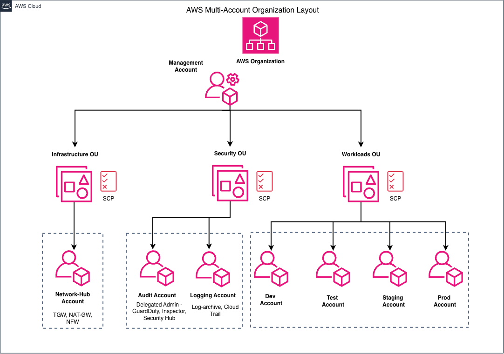
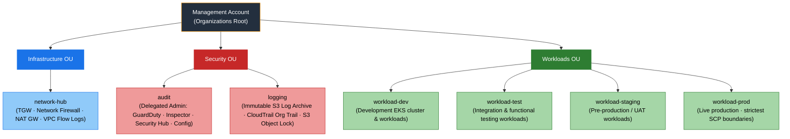

# DIA-01: Multi-Account AWS Organisation Layout

This diagram illustrates the AWS Organizations hierarchy for the Zero-Trust Network Egress & Automated Operations Platform. Eight accounts are grouped into three Organizational Units under a Management root: Infrastructure OU (network-hub), Security OU (audit and logging), and Workloads OU (dev, test, staging, and prod). Service Control Policies applied at the OU level enforce Zero Trust controls — blocking direct internet egress and open SSH/RDP ingress — across all member accounts.

