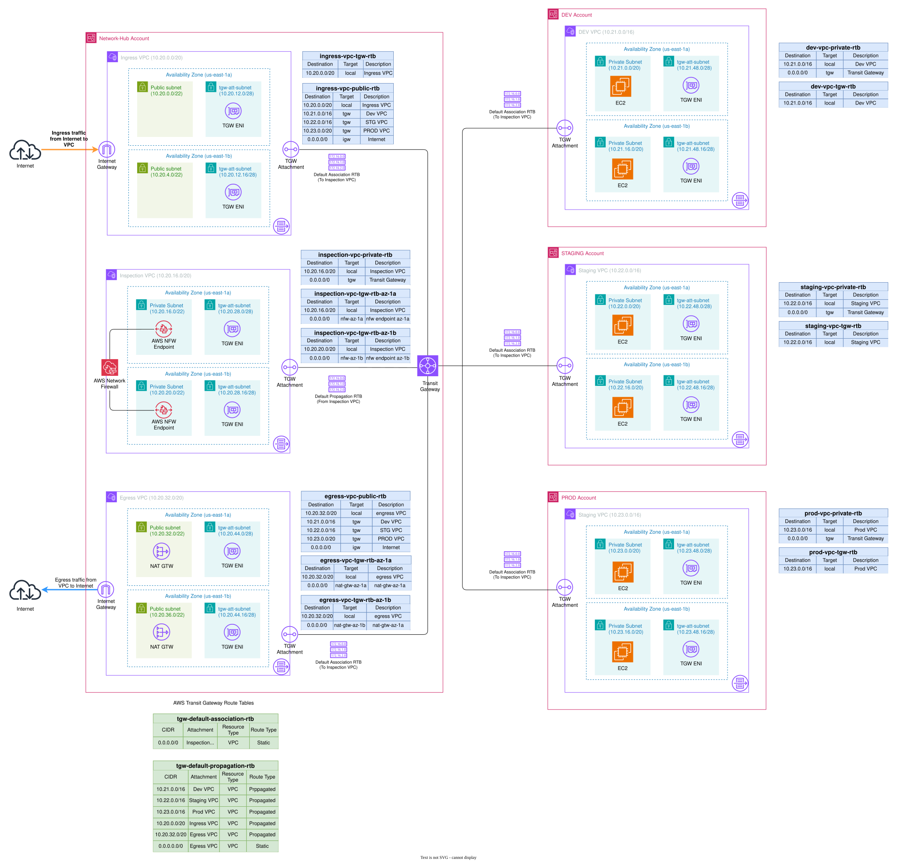
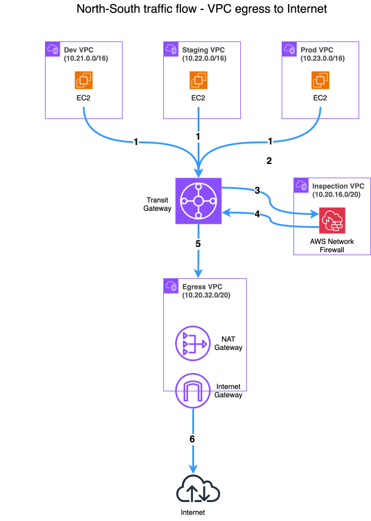

# DIA-02: Hub-Spoke Network Architecture using AWS Transit Gateway + Egress Traffic inspection using AWS Network Firewall

This diagram illustrates the hub-spoke network topology built on AWS Transit Gateway (TGW). Workload spoke VPCs route all egress traffic through the TGW to the centralised Network-Hub VPC, where AWS Network Firewall performs stateful inspection in the `private` subnets in the workload accounts, before traffic exits via NAT Gateway in the `egress-vpc` subnet. Each VPC — both hub and spoke — is divided into subnet tiers: `public`, `private`, and a dedicated `/28` `tgw-attach` subnet for Transit Gateway attachment.

