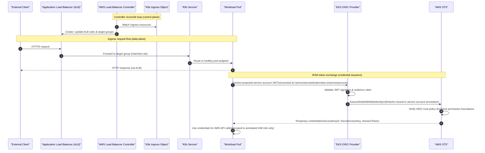

# DIA-03: EKS Ingress & IRSA Authentication Flow

This diagram shows two concurrent flows for an EKS-hosted workload. The ingress request flow traces an external client through the Application Load Balancer — managed by the AWS Load Balancer Controller from a Kubernetes `Ingress` object — down to the target Pod. The IRSA (IAM Roles for Service Accounts) token exchange flow shows how that same Pod obtains short-lived AWS credentials: it presents a projected service account token to the OIDC provider, which validates the token and forwards the request to AWS STS, and STS returns temporary IAM role credentials scoped to the pod's identity — with no broad node-level instance profile required.

