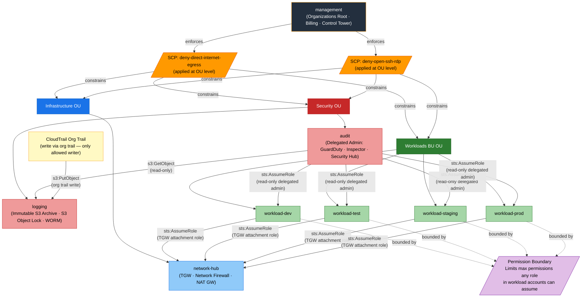

# DIA-04: Cross-Account IAM Trust Relationships

This diagram shows the IAM assume-role trust relationships and permission boundaries that govern cross-account access in the Zero-Trust platform. The `management` account enforces two Service Control Policies — denying direct internet egress and open SSH/RDP — at the OU level, constraining every member account regardless of their local IAM policies. The `audit` account holds delegated administrator trust into all workload accounts for GuardDuty, Inspector, and Security Hub (read-only), while workload accounts assume a role in `network-hub` to attach their VPCs to the Transit Gateway. The `logging` account is a write-protected archive: only the CloudTrail organisation trail may write to it, and the `audit` account has read-only cross-account access for ingestion.

