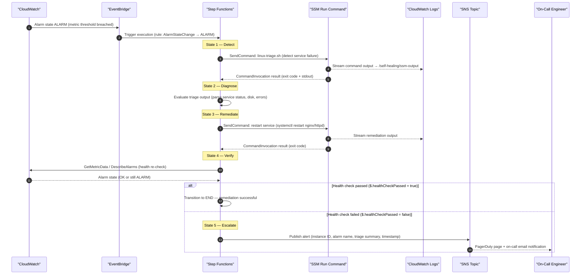

# DIA-05: Self-Healing Workflow

This diagram illustrates the event-driven self-healing automation flow triggered when a workload failure is detected. A CloudWatch Alarm fires and routes through EventBridge to invoke an AWS Step Functions state machine, which orchestrates five sequential states: Detect, Diagnose, Remediate, Verify, and Escalate. SSM Run Command executes diagnostic and remediation scripts on the target instance, and SNS publishes an on-call alert if automated recovery is unsuccessful.

