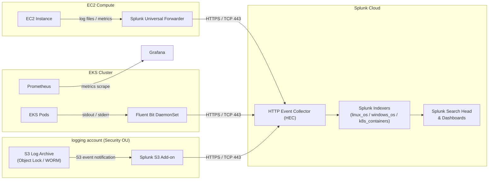

# DIA-06: Observability Data Flow

This diagram illustrates how telemetry data flows from all platform layers into the centralised
Splunk Cloud observability stack. EC2 compute instances ship logs and metrics via the Splunk
Universal Forwarder over HTTPS to the Splunk HTTP Event Collector (HEC), while containerised
workloads running on EKS are covered by a Fluent Bit DaemonSet that forwards logs to the same
HEC endpoint. Immutable S3 logs stored in the dedicated `logging` account are ingested by the
Splunk S3 Add-on, and Prometheus scrapes cluster metrics that are visualised in Grafana.

