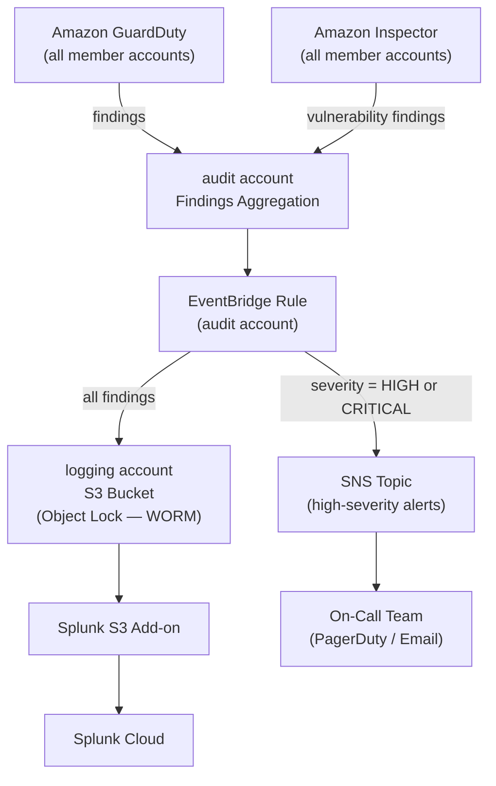

# DIA-07: Threat Detection Data Flow

This diagram illustrates how security findings from Amazon GuardDuty and Amazon Inspector flow through the platform's centralised detection and response architecture. All findings are aggregated in the `audit` account, which acts as the delegated administrator for both services across the AWS Organisation. An EventBridge rule in the `audit` account routes findings to the `logging` account's immutable S3 archive for long-term retention and Splunk ingestion, while high-severity findings trigger an SNS notification to the on-call team for immediate response.

