# DIA-08: CI/CD Promotion Pipeline

This diagram illustrates the end-to-end CI/CD promotion pipeline from developer commit to production deployment. A developer push to the Application Repository triggers a GitHub Actions workflow that runs lint checks, Checkov IaC security scanning, terraform plan validation, container image build, and ECR push. Flux CD continuously polls ECR for new image tags; upon detection it reconciles the Dev environment automatically, while promotion to Test, Staging, and Production each requires a pull request against the GitOps repository to enforce a human approval gate.

```mermaid
flowchart TD
    Dev["👤 Developer"]
    AppRepo["📦 Application Repository\n(GitHub)"]

    Dev -->|"git push"| AppRepo

    subgraph CI["⚙️ GitHub Actions CI Pipeline"]
        direction TB
        Lint["🔍 Lint"]
        Checkov["🛡️ Checkov\n(IaC Security Scan)"]
        TFPlan["📋 terraform plan"]
        Build["🔨 Image Build"]
        ECRPush["📤 Push to ECR"]

        Lint --> Checkov --> TFPlan --> Build --> ECRPush
    end

    AppRepo --> Lint

    ECR["🗄️ Amazon ECR\n(Image Registry)"]
    ECRPush --> ECR

    ECR -->|"new image tag detected"| FluxDev

    subgraph EnvDev["🟦 workload-dev"]
        FluxDev["🔄 Flux CD\n(Dev Reconcile)"]
        OverlayDev["📁 Dev Overlay\n(GitOps Repo)"]
        ClusterDev["☸️ EKS Cluster — Dev"]
        FluxDev --> OverlayDev -->|"reconcile"| ClusterDev
    end

    ClusterDev -->|"promote via pull request"| PRTest

    PRTest["🔀 PR: Dev → Test\n(human approval gate)"]
    PRTest -->|"merged"| FluxTest

    subgraph EnvTest["🟩 workload-test"]
        FluxTest["🔄 Flux CD\n(Test Reconcile)"]
        OverlayTest["📁 Test Overlay\n(GitOps Repo)"]
        ClusterTest["☸️ EKS Cluster — Test"]
        FluxTest --> OverlayTest -->|"reconcile"| ClusterTest
    end

    ClusterTest -->|"promote via pull request"| PRStaging

    PRStaging["🔀 PR: Test → Staging\n(human approval gate)"]
    PRStaging -->|"merged"| FluxStaging

    subgraph EnvStaging["🟨 workload-staging"]
        FluxStaging["🔄 Flux CD\n(Staging Reconcile)"]
        OverlayStaging["📁 Staging Overlay\n(GitOps Repo)"]
        ClusterStaging["☸️ EKS Cluster — Staging"]
        FluxStaging --> OverlayStaging -->|"reconcile"| ClusterStaging
    end

    ClusterStaging -->|"promote via pull request"| PRProd

    PRProd["🔀 PR: Staging → Prod\n(human approval gate)"]
    PRProd -->|"merged"| FluxProd

    subgraph EnvProd["🟥 workload-prod"]
        FluxProd["🔄 Flux CD\n(Prod Reconcile)"]
        OverlayProd["📁 Prod Overlay\n(GitOps Repo)"]
        ClusterProd["☸️ EKS Cluster — Prod"]
        FluxProd --> OverlayProd -->|"reconcile"| ClusterProd
    end

    style Dev fill:#4A4A4A,color:#FFFFFF,stroke:#4A4A4A
    style AppRepo fill:#24292E,color:#FFFFFF,stroke:#586069
    style CI fill:#0D47A1,color:#FFFFFF,stroke:#1565C0
    style ECR fill:#FF6F00,color:#FFFFFF,stroke:#E65100
    style PRTest fill:#6A1B9A,color:#FFFFFF,stroke:#7B1FA2
    style PRStaging fill:#6A1B9A,color:#FFFFFF,stroke:#7B1FA2
    style PRProd fill:#6A1B9A,color:#FFFFFF,stroke:#7B1FA2
    style EnvDev fill:#E3F2FD,color:#000000,stroke:#1565C0
    style EnvTest fill:#E8F5E9,color:#000000,stroke:#2E7D32
    style EnvStaging fill:#FFFDE7,color:#000000,stroke:#F9A825
    style EnvProd fill:#FFEBEE,color:#000000,stroke:#C62828
```

